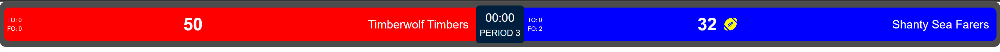
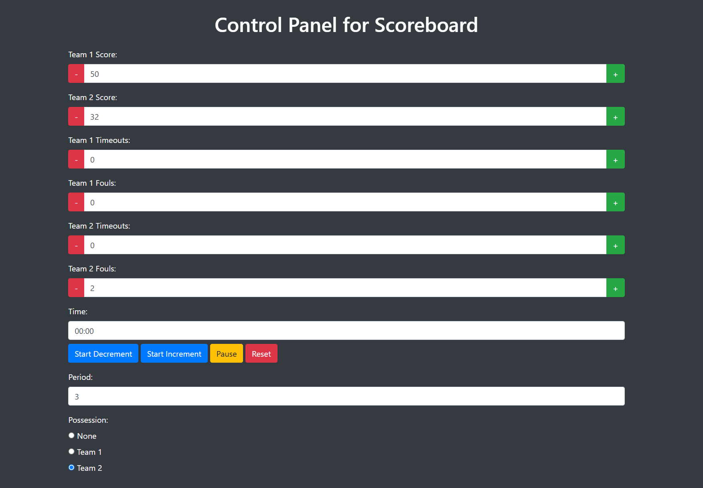
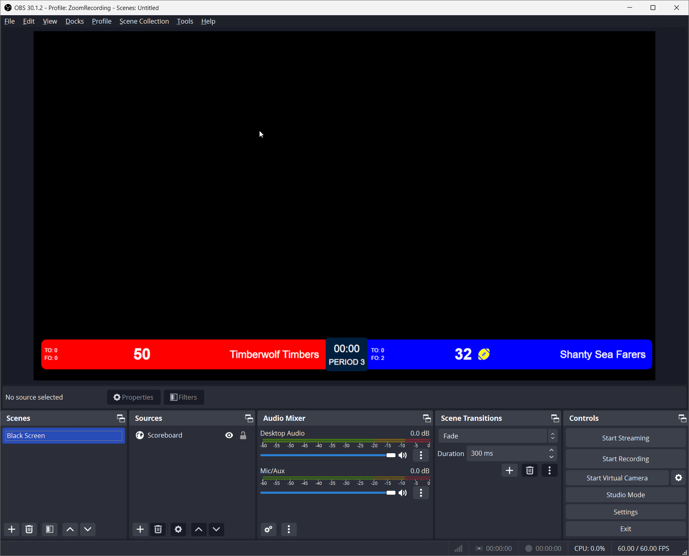

# Scoreboard Overlay for OBS

This project is a Python Flask application that dynamically creates scorecard overlays for use with OBS Studio. It allows for real-time updates to the scoreboard data and supports various possession icons. The scoreboard can be customized with team names, scores, logos, colors, time, period, and possession indicators.

## Features

- Dynamic creation of scorecards
- Real-time updates to scoreboard data
- Customizable team names, scores, logos, and colors
- Timer with start, stop, pause, and reset functionalities
- Selection of possession icons (basketball, football, baseball, table tennis)

## Installation

1. Clone the repository:
    ```sh
    git clone https://github.com/davidjameshowell/obs-scoreboard.git
    cd obs-scoreboard
    ```

2. Install the required dependencies:
    ```sh
    pip install -r requirements.txt
    ```

3. Run the Flask application:
    ```sh
    python app.py
    ```

## Usage

### Creating a Scoreboard

1. Open your web browser and navigate to `http://localhost:5000`.
2. Fill out the form with the required details for Team 1 and Team 2.
3. Select the desired possession icon from the dropdown menu.
4. Click the "Generate Scorecard" button.
5. The application will redirect you to the generated scoreboard page.

### Controlling the Scoreboard

1. Open the control panel by navigating to `http://localhost:5000/control/<guid>`, where `<guid>` is the unique identifier for your scoreboard.
2. Use the control panel to update scores, time, period, possession, and other details in real-time.

### Adding the Scoreboard as a Source in OBS Studio

1. Open OBS Studio.
2. Click the `+` button in the Sources panel to add a new source.
3. Select `Browser` from the list of source types.
4. Enter the URL of your generated scoreboard (e.g., `http://localhost:5000/scorecard/<guid>`) in the URL field.
5. Set the width and height to match your scoreboard dimensions (e.g., width: 1280, height: 720).
6. Click `OK` to add the scoreboard as a source.

## Example

Here is an example of a generated scoreboard:



Here is an example of the scoreboard control panel:



Here is an example of the scoreboard in OBS:



## Contributing

Contributions are welcome! Please open an issue or submit a pull request for any changes or improvements.

## License

This project is licensed under the MIT License. See the [LICENSE](LICENSE) file for details.
